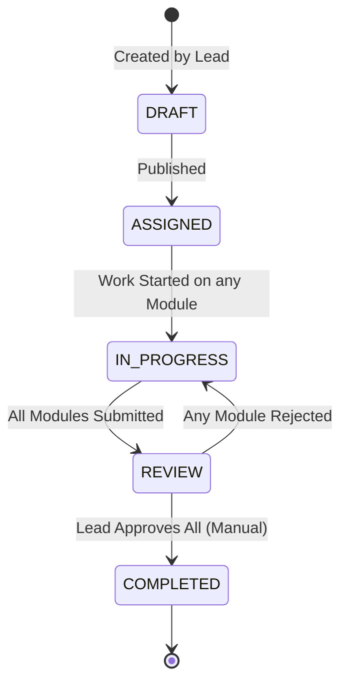
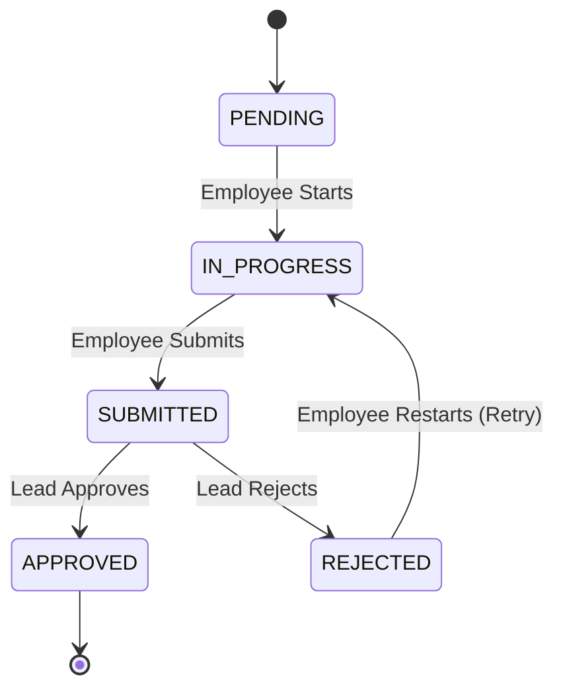

# Business Workflow Design

## 1. Overview
This document outlines the business logic for the Employee Task System, covering the lifecycle of tasks from creation by Team Leads to execution by Employees and final approval.

## 2. Core Workflows

### 2.1 Lead Creates Task
**Actor:** Team Lead
1.  **Creation**: Lead creates a `Task` container (Status: `DRAFT`).
2.  **Decomposition**: Lead adds 1 or more `Modules` to the Task.
    *   Each Module represents a specific deliverable or sub-task.
3.  **Assignment**: Lead assigns one or more `Employees` to each Module.
    *   **Multi-Assignee Logic**: Modules are treated as "Collaborative Work Items". All assigned employees share the same module state.
4.  **Publish**: Lead publishes the Task.
    *   Task transitions from `DRAFT` -> `ASSIGNED`.
    *   Notifications sent to all assigned employees.

### 2.2 Execution & Status Updates
**Actor:** Employee(s)
1.  **Start Work**: Any assigned employee can move a Module from `PENDING` -> `IN_PROGRESS`.
    *   *System Upgrade*: Parent Task moves to `IN_PROGRESS` automatically.
2.  **Module Updates**: Employees work on the module.
    *   *Concurrency*: Optimistic locking ensures data integrity if multiple employees edit simultaneously.
3.  **Submission**: Employee submits the module (`SUBMITTED`).
    *   Trigger: "Submit for Review" action.
    *   Logic: Prevents further edits by employees until reviewed.

### 2.3 Review & Completion
**Actor:** Team Lead
1.  **Notification**: Lead receives notification of `SUBMITTED` modules.
2.  **Review**:
    *   **Approve**: Module moves to `APPROVED`.
    *   **Reject**: Module moves to `REJECTED`.
3.  **Task Completion**:
    *   Auto-Check: When a module is approved, system checks if *all* modules in the Task are `APPROVED`.
    *   If yes: Task moves to `REVIEW` (Ready for Completion).
    *   **Final Action**: Lead reviews the completed modules and explicitly marks Task as `COMPLETED`.
    *   Notification sent to Lead and all Assignees.

### 2.4 Reassignment & Retries
**Actor:** Team Lead / System
*   **Reassignment**:
    *   Lead can change `assigneeIds` at any time.
    *   *Logic*: Current status is preserved. New assignees inherit the current state (e.g., picking up `IN_PROGRESS` work).
*   **Retries (Rejection)**:
    *   If Lead rejects a module, it reverts to `REJECTED` state (functionally similar to `IN_PROGRESS`).
    *   `retryCount` is incremented.
    *   Employees are notified to revise and re-submit.

---

## 3. State Machine Diagrams

### 3.1 Task Lifecycle

### 3.2 Module Lifecycle

---

## 4. Status Rules Table

| Entity | Current Status | Action | New Status | Condition / Side Effect |
| :--- | :--- | :--- | :--- | :--- |
| **Task** | DRAFT | Publish | ASSIGNED | Modules > 0 |
| **Module** | PENDING | Start | IN_PROGRESS | Update parent Task to IN_PROGRESS |
| **Module** | IN_PROGRESS | Submit | SUBMITTED | Notify Lead |
| **Module** | SUBMITTED | Approve | APPROVED | Check Task Completion (-> REVIEW) |
| **Module** | SUBMITTED | Reject | REJECTED | Increment RetryCount, Notify Employee |
| **Module** | REJECTED | Start | IN_PROGRESS | - |

---

## 5. Edge Case Handling

1.  **Orphaned Modules**:
    *   *Scenario*: All assignees removed from a module.
    *   *Handling*: Module remains in current state but flagged as "Unassigned". Task cannot be completed until resolved.

2.  **Edit Conflict (Race Condition)**:
    *   *Scenario*: Two employees submit a module simultaneously.
    *   *Handling*: Backend uses specific "Last-Write-Wins" or Atomic Transactions. UI handles version mismatch errors.

3.  **Task Cancellation**:
    *   *Scenario*: Lead cancels a task mid-progress.
    *   *Handling*: Task -> `ARCHIVED`. All incomplete modules -> `ARCHIVED`.

4.  **All Modules Rejected**:
    *   *Scenario*: Lead rejects all work.
    *   *Handling*: Task reverts from `REVIEW` to `IN_PROGRESS`.
